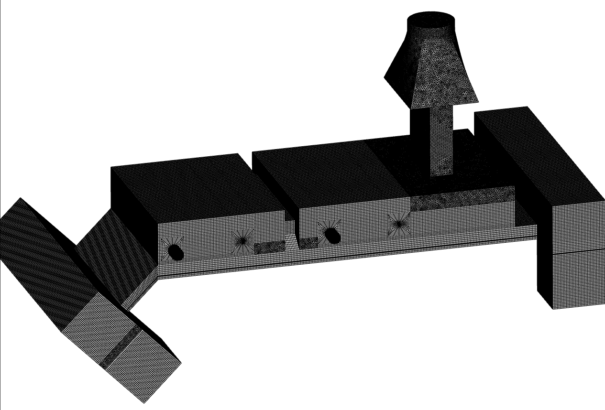
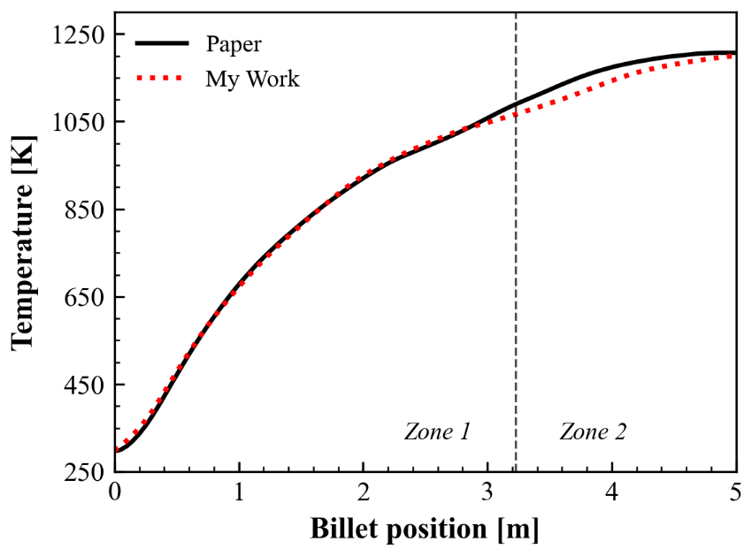
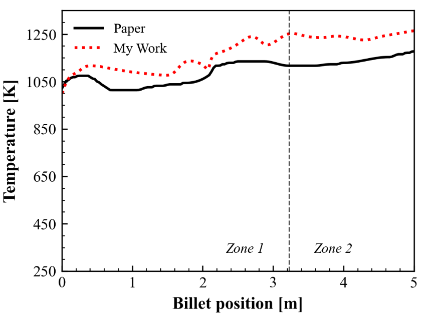

# 연속식 가열로 · 선행연구 재현과 결과 검토

[포트폴리오 홈](../../README.md)

**자료 기준: 2026-07-21 연구 진행 기록**  
**역할: 격자 구성, Fluent 해석, 선행연구 대비 온도·열유속 비교**

## 연구 내용

선행연구의 가열로 모델을 재현하며 소재와 가스의 온도, 복사 및 대류 열유속을 비교했습니다. 이 페이지는 완료된 검증 성과가 아니라, 어떤 지표가 맞고 어떤 지표가 남아 있는지 나누어 확인한 과정입니다. 앞의 정지 소재 가열로 POD+RBF 결과와는 별개의 해석 사례입니다.

*2026-07-21 자료 4쪽의 해석 도메인. 해당 시점의 격자 구성입니다.*

## 비교한 지표

| 소재 중심 온도 | 가스 온도 |
|---|---|
|  |  |

*2026-07-21 자료 6쪽. 검은 선은 비교 대상으로 사용한 논문 결과, 붉은 점선은 당시 수행한 CFD 결과입니다. 원본 발표자료에서는 소재 중심 온도 최대 차이 약 35 K, 가스 온도 최대 차이 약 136 K로 정리했습니다.*

소재 온도가 가까워져도 가스 온도는 전반적으로 높게 계산되는 구간이 있었습니다. 따라서 소재 온도 하나만으로 전체 열전달이 재현되었다고 판단할 수 없었습니다.

## 문제 해결 과정

- 화염 발생 영역과 소재 부근 격자를 세밀하게 수정하고, 다른 영역의 계산량을 조정했습니다.
- 격자를 수정한 결과가 모든 지표에서 개선되지는 않았습니다.
- 온도와 함께 복사·대류 열유속을 구분하여, 차이가 나타나는 구간과 물리모델·경계조건을 검토했습니다.

이 경험을 통해 격자 세분화나 반복 횟수 증가만으로 설명하기 어려운 차이를 구분하고, 설정과 평가 위치를 함께 점검하는 습관을 쌓았습니다.

## 후속 방향

연소·복사와 소재 이동을 포함하는 해석으로 연구 범위를 확장하고, 해석 코드의 계산 흐름을 이해하는 것이 후속 방향입니다. 이 페이지의 그림과 수치는 2026년 7월 기록에 한정되며 이후 연구의 최종 결과를 나타내지 않습니다.
