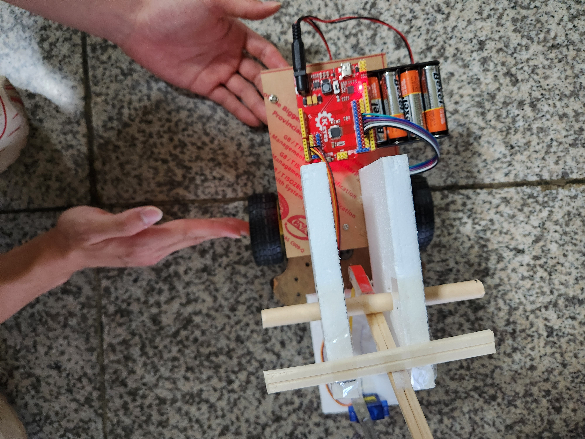
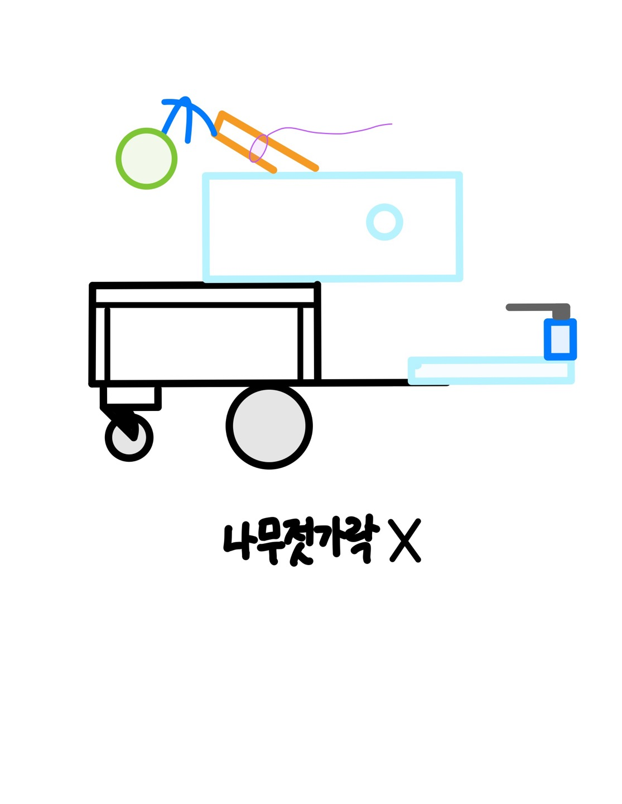
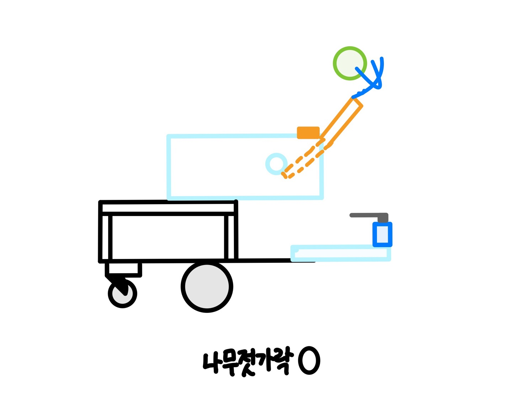

# 창의도전설계 · 제작과 시험을 통한 협업

[포트폴리오 홈](../../README.md)

**기간: 2023년 1학기**  
**역할: 팀원으로 아이디어 논의, 제작·시험 및 개선 과정 참여**

학기 동안 네 개의 팀 프로젝트를 수행했습니다. 정해진 부품과 제작 환경에서 목표 기능을 구현하고, 부품이 예상대로 동작하지 않을 때 팀원들과 원인을 찾아 수정했습니다.

## GO & SHOOT

RC카가 발사구역으로 이동한 뒤 탁구공을 발사하는 장치를 제작했습니다. 아래는 2023년 6월 설계일지에 기록된 제작 과정입니다.

*팀 설계일지의 최종 제작물 사진. 제작 및 개선은 팀 공동 작업입니다.*

| 문제 | 팀이 수행한 변경·시험 | 확인한 결과 |
|---|---|---|
| 서보모터로 발사대를 원하는 각도까지 당기기 어려움 | 발사대를 미리 당겨 고정하고, 모터로 고정을 해제하는 구조로 변경 | 이동 후 정지·발사 동작 구현 |
| 하드보드지 가공이 보유 도구로 어려움 | 가공 가능한 스타이로폼 지지대와 나무젓가락·빨대 구조 사용 | 사용 가능한 재료로 제작 진행 |
| 탁구공이 아래로 발사됨 | 손으로 발사대를 당겨 회전·정지 위치 확인, 정지부 및 발사대 길이 수정 | 발사 방향을 조정 |
| 같은 제어값에서도 RC카 경로가 달라짐 | 앞바퀴 방향, 건전지 위치, 두 모터 PWM 조정 방식 검토 | 오른쪽 쏠림 감소, 비교적 일정한 주행 조건 확보 |

### 팀원의 관찰을 시험으로 연결

| 발사대 정지 위치 수정 전 | 정지부 추가 아이디어 |
|---|---|
|  |  |

*팀 설계일지의 원본 스케치. 탁구공이 아래로 향하는 문제를 발사대의 정지 위치와 연결해 검토했습니다.*

RC카가 오른쪽으로 치우칠 때 팀원 한 명이 건전지 위치를 바꿔보자고 제안했습니다. 처음에는 효과가 있을지 확신하지 못했지만 함께 시험했고, 치우침이 감소하는 것을 확인했습니다. 이후 한쪽 모터의 값을 고정하고 다른 쪽을 조정하는 방식도 바꾸어 보며 주행 조건을 찾았습니다.

의견 차이가 있을 때 상대가 해결하려는 문제를 먼저 듣고, 말로 판단하기 어려운 부분은 실제 동작을 확인하며 결정하는 경험을 했습니다. 완벽한 직진이나 대회 고득점을 달성했다는 기록은 없으며, 설계일지에서 확인되는 성과는 발사 기능 구현과 주행의 일관성 개선입니다.

## Jumping Car · 아이디어 평가 기준

2023년 5월 점핑카 프로젝트에서는 다음 기준으로 다섯 가지 아이디어를 비교했습니다.

- 전복 가능성 최소화
- 목표 지점 명중
- 제작 가능성
- 경제성

전복 후 복원 구조, 날개 형태, 낙하 속도를 줄이는 구조 등 여러 방안을 논의하고 필요한 재료를 선정했습니다. 이 일지는 아이디어 구상 단계의 기록으로, 모든 방안이 실제로 구현·검증된 것은 아닙니다.

## 경험을 정리하고 전달한 활동

이 과정을 「공학자로서의 한 걸음을 내딛다」라는 좋은수업에세이로 작성해 공모전에서 수상했습니다. 별도 등급을 구분하지 않는 수상이었으며, 수상자 중 발표자로 선정되어 교수님들 앞에서 프로젝트 경험과 수업에서 배운 점을 공유했습니다.

**근거 자료:** 「설계일지3」, 「마지막 설계일지」, 좋은수업에세이 및 발표자료. 팀원의 아이디어와 공동 결과를 개인의 단독 성과로 구분하지 않도록 역할을 명시했습니다.
