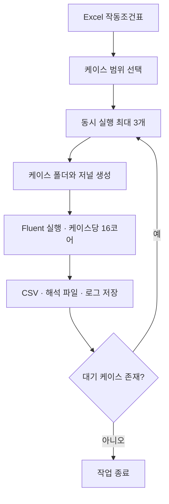

# Python을 활용한 Fluent 반복 해석 자동화

[포트폴리오 홈](../../README.md) · [실제 코드](../../code/fluent-batch/run_fluent_batch.py)

**역할: 작업 흐름과 입출력 정의, 생성형 AI를 활용한 Python 코드 구현 및 연구 적용**

## 문제

온도 예측모델을 학습시키려면 여러 작동조건의 CFD 결과가 필요했습니다. 조건마다 Fluent에서 유량·온도를 변경하고 계산한 뒤 결과를 추출하는 작업을 수동으로 반복하기 어려웠습니다.

## 구현한 흐름

Excel 조건표에서 실행할 케이스 범위를 선택하면 다음 과정을 자동으로 수행하도록 구성했습니다.

1. 케이스별 폴더를 만들고 기준 해석 파일과 연소 테이블을 복사합니다.
2. 연료·공기·출구 유량 및 공기 온도를 반영한 Fluent 저널을 작성합니다.
3. Fluent를 실행하고 계산 로그를 케이스별로 저장합니다.
4. 지정한 반복 단계에서 온도와 온도 구배를 CSV 파일로 내보내고 해석 파일을 저장합니다.

*실행 흐름 설명도. 원본 코드의 스레드 풀 작업 처리를 개념적으로 나타냈습니다.*

## 코드에서 확인할 수 있는 구현

| 항목 | 구현 내용 |
|---|---|
| 조건 입력 | `Pandas.read_excel`로 조건표 로드 |
| 범위 선택 | `case_no`에서 숫자를 추출해 시작·끝 번호로 필터링 |
| 설정 생성 | 케이스별 `bk.jou` 작성, 3자리 유효숫자로 조건 입력 |
| 실행 제어 | `ThreadPoolExecutor(max_workers=3)` |
| 계산 자원 | Fluent 실행당 16코어, 최대 3개로 명목상 총 48코어 |
| 결과 추출 | 10회와 추가 9,990회 반복 후 온도·온도 구배 추출 명령 |
| 기록 | 케이스별 `mon.log`에 표준 출력과 오류 출력 저장 |

코드의 실행 범위는 24~128로 설정되어 있습니다. 실제 작업 수는 Excel에서 이 범위에 해당하는 행 수에 따라 결정됩니다. 이 설정값만으로 완료한 데이터셋 규모를 주장하지 않습니다.

## 연구에서의 활용

수동으로 경계조건을 바꾸고 계산을 시작하며 결과를 저장하는 부담을 줄였습니다. 이 과정을 통해 여러 작동조건의 데이터를 준비하고, 후속 예측모델 비교에 사용할 수 있었습니다. 자동화 전후의 사람 작업시간을 별도로 계측하지 않아 인력 절감률은 제시하지 않습니다.

생성형 AI를 코드 작성에 활용했으며, 필요한 경계조건과 저장 변수, 작업 순서를 연구에 맞춰 정의했습니다.

## 공개 코드의 범위

[연구 당시 코드](../../code/fluent-batch/run_fluent_batch.py)는 제공된 버전을 보존했습니다. 실제 Fluent 환경에서 이 포트폴리오를 만들며 다시 실행하지는 않았습니다.

- 기준 CAS/DAT, PDF/FLA 연소 테이블, 실제 Excel 조건표와 Fluent 라이선스는 별도로 필요합니다.
- 고정 반복 횟수로 계산하며, 케이스별 수렴·물리적 타당성을 자동 판정하지 않습니다.
- 실행 종료코드 확인·실패 재시도·이어서 실행하는 기능은 이 버전에 구현되어 있지 않습니다. 콘솔의 완료 문구만으로 해석 성공을 판단할 수 없습니다.

자세한 입력 형식과 결과 파일은 [코드 안내](../../code/fluent-batch/README.md)에 정리했습니다.
