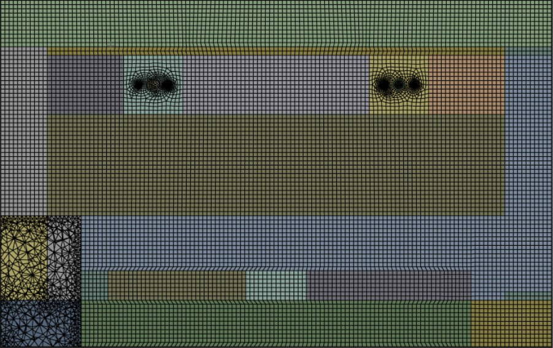
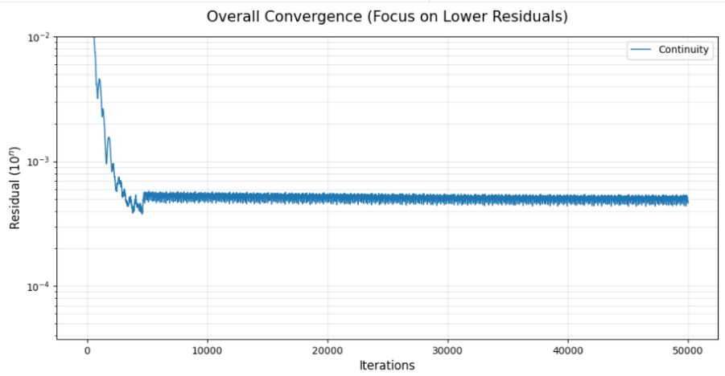
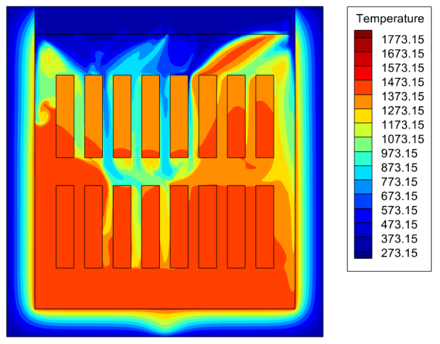
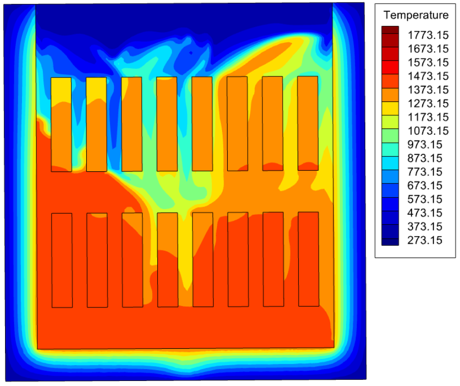

# 가열로 CFD 해석 개선

[포트폴리오 홈](../../README.md) · [온도 예측 연구](../furnace-rom/README.md)

**주요 기록: 2025년 11월 ~ 2026년 1월**  
**역할: 기존 모델 검토, 격자 구성 변경, 모델별 계산 및 결과 비교**

## 문제와 목표

가열로의 작동조건을 여러 개 비교하려면 먼저 반복 계산에 사용할 해석 기반이 필요했습니다. 연구실에서 인계받은 모델은 셀 수가 많고 잔차가 높아, 계산시간과 수렴 상태를 함께 검토해야 했습니다.

목표는 계산 부담을 줄이면서, 격자와 모델 선택이 소재 온도 및 열전달 결과에 미치는 영향을 확인하는 것이었습니다.

## 접근 방법

1. 기존 해석 파일을 바탕으로 압축성 가정과 복사 모델 등을 비교했습니다.
2. 유체 영역과 외벽 고체 영역의 분할 및 격자 구성을 변경했습니다.
3. Species Transport와 Non-premixed Combustion 설정에서 계산시간, 잔차, 소재 평균온도를 함께 비교했습니다.

*최종 격자 구성의 단면. 2026-01-13 발표자료, 3쪽. 유체 영역과 외벽을 포함하는 구성을 검토했습니다.*

## 정량 결과

아래는 **Species Transport 모델, 동일 32코어, 2,000회 반복에 걸린 시간**의 비교입니다. 잔차는 별도로 50,000회 반복 후 기록된 값입니다.

| 구성 | 셀 수 | 2,000회 반복 시간 | 소재 질량가중 평균온도 [K] | Continuity 잔차 | Energy 잔차 |
|---|---:|---:|---:|---:|---:|
| 기존 모델 | 11,932,366 | 240분 | 1386.944 | 7.2422e-02 | 2.2728e-05 |
| Case 1 | 3,189,262 | 120분 | 1364.511 | 7.6108e-04 | 8.7714e-06 |
| Case 2 | 3,736,797 | 110분 | 1365.358 | 2.9822e-04 | 1.9093e-06 |
| Final case | 2,227,250 | 50분 | 1361.207 | 4.7692e-04 | 1.1307e-07 |

출처: 2026-01-13 발표자료 12쪽의 비교표. [CSV](../../data/mesh-comparison.csv)

동일 반복 수 기준 계산시간을 약 **79.2%** 줄였습니다. 이 수치는 수렴 완료까지의 전체 계산시간 감소율을 의미하지 않습니다. 기존 모델과 최종 모델 사이의 소재 평균온도 차이는 약 **25.7 K**로, 속도 개선과 온도 변화는 함께 검토해야 합니다.

*Final case의 continuity 이력. 2026-01-13 발표자료, 5쪽.*

## 온도분포 비교

| 기존 모델 | Final case |
|---|---|
|  |  |

*2026-01-13 발표자료 8~9쪽의 Species Transport 결과. 원본 그림의 색상 범위를 유지했습니다.*

## 배운 점과 적용 범위

- 격자 수 자체뿐 아니라 영역 분할과 격자 배치가 계산 부담에 영향을 주었습니다.
- 잔차가 낮아지는 것과 선행연구의 온도·열유속 결과에 가까워지는 것은 별도로 확인해야 했습니다.
- 이 비교는 계산 효율과 해석 설정을 검토한 기록입니다. 체계적인 격자 독립성 검증이나 실험 검증을 완료했다는 의미로 사용하지 않습니다.

이후 이 경험을 바탕으로 [작동조건별 반복 해석 자동화](../fluent-automation/README.md)와 [온도분포 예측모델](../furnace-rom/README.md)을 연구했습니다.
