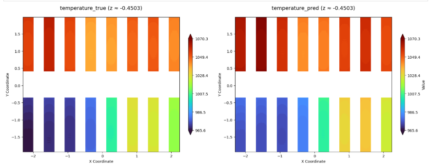
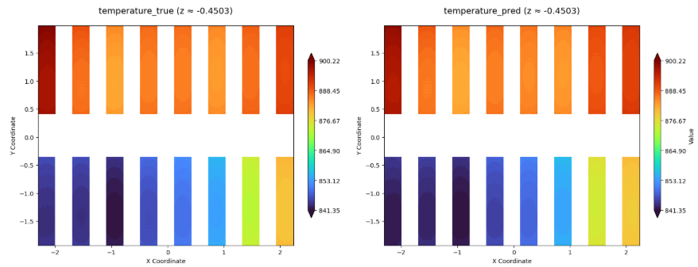
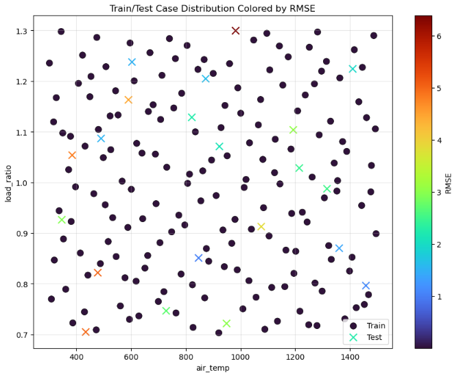

# POD+RBF 기반 가열로 소재 온도분포 예측

[포트폴리오 홈](../../README.md) · [자동화 코드](../../code/fluent-batch/README.md)

**주요 기록: 2026년 2~4월**  
**역할: CFD 데이터 생성, 데이터 추출 방식 검토, 모델 구성·비교, 예측 결과 평가**

## 문제와 목표

여러 작동조건을 비교할 때 조건마다 CFD 계산을 수행하면 많은 시간이 필요합니다. 연구실의 기존 CFD 연구에 데이터 기반 예측을 새롭게 결합하여, 작동조건으로부터 소재의 온도분포를 빠르게 얻는 것을 목표로 삼았습니다.

POD로 온도장의 주요 패턴을 추출하고, RBF로 작동조건과 POD 계수 사이의 관계를 예측한 뒤 온도장을 복원하는 방법을 검토했습니다. 새로운 POD·RBF 알고리즘을 제안한 연구가 아니라, 가열로 문제에 적용하고 여러 방법의 성능을 비교한 경험입니다.

## 수행 과정

| 단계 | 수행한 내용 |
|---|---|
| 조건 선정 | Sobol 시퀀스를 이용한 작동조건 선정과 경계조건 정의 |
| 데이터 생성 | 조건별 Fluent 해석 및 CSV 추출 자동화 |
| 데이터 검토 | 셀 중심값·절점값·단면 보간값의 차이와 좌표 대응 검토 |
| 모델 비교 | U-Net, DeepONet, POD+신경망, POD+회귀 방법 등의 적용 결과 비교 |
| 평가 | CFD 대비 테스트 케이스별 RMSE와 예측 온도분포 확인 |

연구 초기에는 특정 케이스의 좋은 결과와 전체 테스트 성능이 크게 달랐습니다. 모델 설정 변경 외에도 데이터가 어떤 위치의 값을 의미하는지, 후처리 그림에 어떤 보간이 포함되는지를 검토했습니다.

## POD+RBF 결과

| 지표 | 보고값 | 의미 |
|---|---:|---|
| 테스트 평균 RMSE | **2.89 K** | 테스트 케이스별 온도분포 RMSE의 평균 |
| 테스트 최대 RMSE | **6.38 K** | 가장 큰 케이스별 RMSE. 개별 격자의 최대 절대오차가 아님 |
| 테스트 최소 RMSE | **1.00 K** | 가장 작은 케이스별 RMSE |
| CFD 계산시간 | **약 4시간 / 조건** | 연구 수행자의 실행 경험 |
| 학습 후 모델 예측시간 | **1초 미만 / 조건** | 데이터 생성·학습 시간을 제외한 예측 단계 |

수치 출처: 2026-04-28 발표자료 12쪽 및 연구 수행자의 확인. [CSV 요약](../../data/rom-summary.csv)

### 테스트 최대 RMSE 사례

*왼쪽: CFD, 오른쪽: 예측. 해당 케이스의 RMSE는 6.38 K입니다. 원본의 온도 범례를 유지했으므로 색상만으로 오차 크기를 판단하지 않고 수치 지표와 함께 확인합니다.*

### 테스트 최소 RMSE 사례

*왼쪽: CFD, 오른쪽: 예측. 해당 케이스의 RMSE는 1.00 K입니다.*

### 작동조건 분포

*2026-04-28 발표자료 12쪽. 가로축은 공기 온도, 세로축은 부하율이며, 원본 범례에 따라 학습·테스트 조건과 RMSE를 표시한 그림입니다.*

## 평가 범위와 다음 단계

2026-04-28 자료에서는 U-Net을 제외한 비교에 케이스 84~256을 학습·검증, 257~277을 테스트로 사용했다고 기록했습니다. 앞선 케이스를 포함했을 때 성능이 낮았으며, 같은 자료의 계획 페이지에는 데이터의 물리적 타당성을 다시 검토할 필요가 있다는 기록도 남아 있습니다. 따라서 **2.89 K는 당시 비교에 사용한 CFD 데이터에 대한 예측 오차**로 해석합니다. 실험 정확도나 전체 작동범위의 성능을 보증하는 수치는 아닙니다.

발표자료에는 POD+RBF 구현의 참고 대상으로 `Ruansh233`이 표기되어 있습니다. 현재 저장소에는 해당 모델의 원본 코드·가중치·CFD 데이터베이스가 포함되지 않아 이 수치를 독립적으로 재계산할 수는 없습니다.

소재 온도와 균일성을 만족하면서 연료 사용을 줄이는 최적화는 후속 목표이며, 이 포트폴리오 작성 시점에는 완료하지 않았습니다.
