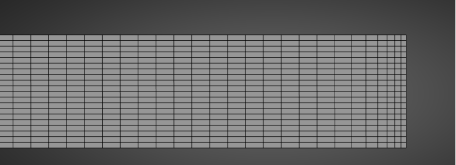
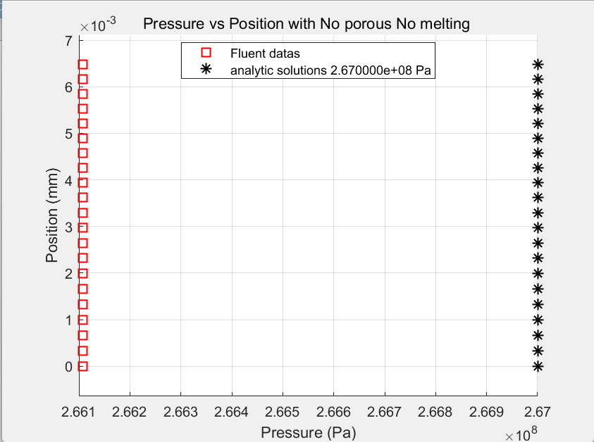
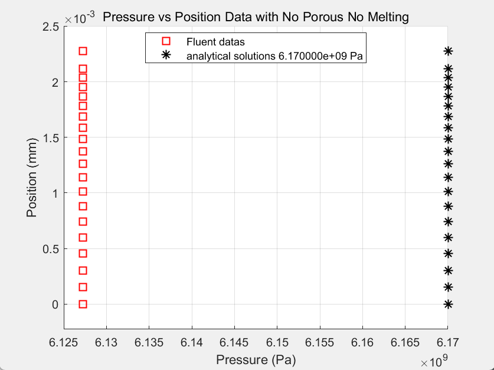
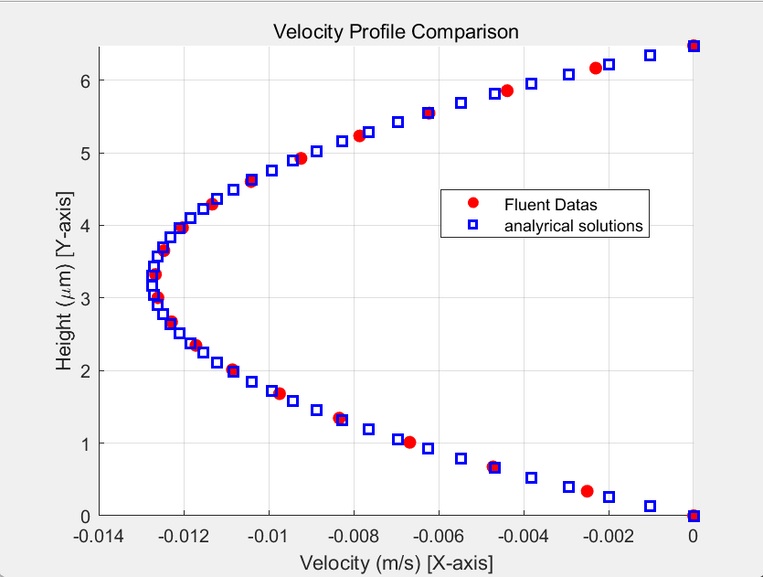

# HBM 압착 유동의 기초 수치 검증

[포트폴리오 홈](../../README.md)

**주요 기록: 2025년 11월**  
**역할: 단순화한 압착 유동 설정, 윤활이론 기반 해석해 검토, 격자 수정 및 CFD 비교**

## 배경과 목표

HBM 관련 압착 유동을 해석하기 전에, 얇은 간극에서 벽이 움직일 때 발생하는 압력과 속도를 제대로 계산하는지 확인했습니다. 상변화와 다공성 효과를 한 번에 포함하기보다, 두 효과를 제외한 기초 조건에서 해석해와 CFD 결과를 비교했습니다.

## 기초 검증 조건

| 항목 | 설정 |
|---|---|
| 영역 길이 | 11 mm |
| 초기 간극 | 0.007 mm, 즉 7 μm |
| 벽 이동 속도 크기 | 0.00001 m/s |
| 시간 간격 | 0.0001 s |
| 격자 | 길이 방향 10,000 × 높이 방향 20, 총 200,000셀 |
| 비교 시점 | 0.0525 s, 0.4725 s |
| 평가 위치 | 중앙에서 압력, 출구에서 속도 분포 확인 |
| 단순화 | 비압축성 층류, 상변화·다공성 효과 제외 |

출처: 2025-11-11 발표자료 7~9쪽 및 2025-11-04 윤활이론 정리.

*2025-11-11 자료 7쪽. 원본 화면의 표시 비율이며, 실제 가로·세로 길이 비율을 나타내는 축척도는 아닙니다.*

## 압력 비교

| 시점 | 보고된 압력 상대오차 |
|---|---:|
| 0.0525 s | **0.337%** |
| 0.4725 s | **0.692%** |

| 0.0525 s | 0.4725 s |
|---|---|
|  |  |

*중앙 위치에서 Fluent 압력과 해석해를 비교한 원본 그래프. 세부 축 범위를 좁혀 두 결과의 차이를 표시했습니다.*

## 속도 분포 비교

*2025-11-11 자료 9쪽, 0.0525 s의 출구 속도 분포. 압력의 정량 오차와 별도로 속도 분포 형태도 확인했습니다.*

## 배운 점과 남은 과제

복잡한 모델의 결과를 해석하려면, 먼저 비교 기준을 만들 수 있는 기초 문제에서 수치 설정을 점검해야 한다는 점을 배웠습니다. 작은 간극에 적합한 격자를 구성하고 압력과 속도를 각각 확인했습니다.

두 시점의 압력 오차는 **상변화와 다공성 효과를 제외한 조건**에 한정됩니다. 이후 다공성 효과를 포함한 검토에서는 해석해와 CFD 사이에 큰 차이가 남아 있었습니다. 따라서 이 결과를 HBM 접합 공정 전체의 검증 완료나 제품 성능 검증으로 표현하지 않습니다.
